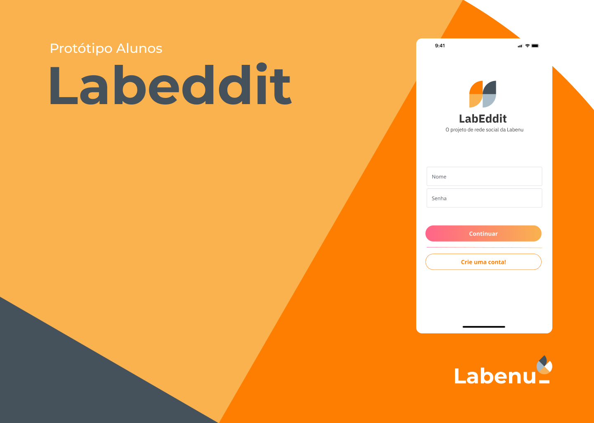

# 📲 Labeddit FullStack Project - Frontend



This is the last project of Labenu's FullStack developer bootcamp and therefore you will see all my knowledge acquired front-end (and back-end) so far!

Labeddit is a social network with the objective of promoting connection and interaction between people. Those who register in the application will be able to create, like or dislike publications, and write, like or dislike comments!

The project was developed from the creation of a Login, Signup, Feed and Post's Comments Pages. And the database's my own API, made exclusevly for this project.

🚩 [Labeddit FullStack Project - Backend](https://github.com/LATerada/labeddit-fullstack-project-backend)


## 📱 Project Funcionalities
* Login Page
* Signup Page
* Feed Page
* Post's comments Page


## 💻 Layout


## 💿 Demonstration


## 📝 How to Install and Run the Project
```bash
# Clone this repository
$ git clone linkrepo

# Acesse the folder in you terminal
$ cd labeddit-fullstack-project-frontend

# Install dependêncies
$ npm install

# Execute the application
$ npm run dev
```


## 📚 Technologies Used
1. [React](https://pt-br.reactjs.org/)
2. [React Router](https://reactrouter.com/en/main)
3. [Tailwind](https://tailwindcss.com/)
4. [Global Context](https://pt-br.reactjs.org/docs/context.html)
5. [Axios](https://axios-http.com/docs/intro)


##  🙋‍♀️ About Creator
[Larissa's Linkedin](https://www.linkedin.com/in/larissa-terada/)
